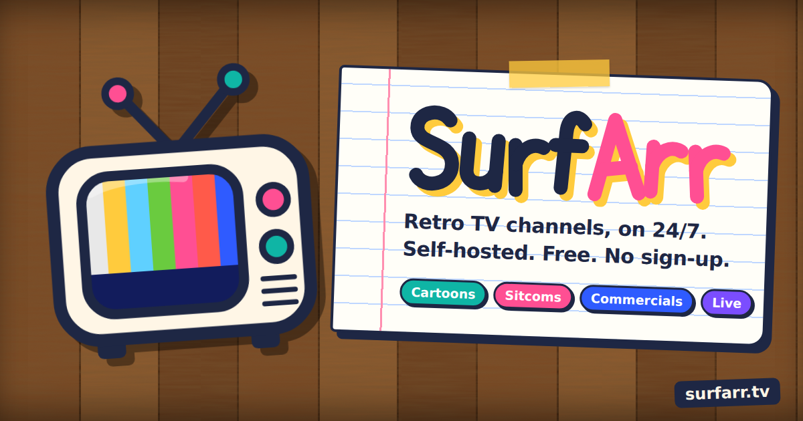

# SurfArr

**Self-hosted YouTube linear TV. Turn YouTube playlists into live cable TV channels organized by decade and genre, complete with HDHomeRun emulation for Plex, Jellyfin, and Emby.**

SurfArr builds a 90+ channel grid (7 decades x 13 categories) that plays 24/7 like real television. Every channel runs on a virtual clock, tune in at any time and the same video is playing for everyone, just like broadcast TV. No recording, no VOD, no on-demand. Just TV.



Formerly RetroArr. Upgrading? See [Coming from RetroArr](#coming-from-retroarr).

---


## Features

- **90+ Live Channels**: 7 decades (60s through 20s) x 13 categories (Cartoons, Sitcoms, Movies, Comedy, Drama, and more)
- **HDHomeRun Emulation**: Detected automatically by Plex, Jellyfin, and Emby as a network tuner via SSDP
- **M3U + XMLTV EPG**: Standard playlist and electronic program guide compatible with any IPTV player
- **Virtual Clock**: Seeded shuffle algorithm ensures every viewer sees the same thing at the same time
- **24-hour EPG**: Auto-generated TV guide synced to the virtual clock
- **Live Channels**: 24/7 YouTube live streams relayed as always-on channels (no clock, no schedule, it's just on)
- **Show-only Playlists**: Reactions, reviews, top-10s, Shorts, trailers and fan edits get filtered out at import and on every sync
- **Internet Archive**: Shows YouTube doesn't have (Burns and Allen, Ozzie and Harriet, Space Patrol, What's My Line?) stream straight from archive.org, mixed into the same channels
- **Themed Channels**: Nick at Nite, Fox Kids, Kids WB, Disney Afternoon, Classic Game Shows, MST3K, G4 and more on 92 to 107
- **House Rules**: English only, no compilations, and nothing under 15 minutes (cartoons and kids shows can go shorter, see `HOUSE_RULE_MIN_MINUTES`)
- **Plugin System**: Add custom channels beyond the grid with community-contributed or your own YAML playlists
- **Plugin Repository**: Browse and install community channel packs directly from the dashboard
- **Web Dashboard**: Manage channels, toggle categories, view the TV guide, report broken videos, and install plugins
- **TV Mode**: Full-screen CRT television UI in the browser with channel surfing (mostly demo purposes)
- **Docker Ready**: Single container with FFmpeg and yt-dlp included

---

## Self-Hosting

### Option 1: Docker (Recommended)

The image ships with everything the streams need: Node 22, FFmpeg and yt-dlp (which refreshes itself on every container start, so YouTube changes don't strand you on a stale build). It runs on `linux/amd64` and `linux/arm64` (Synology, Unraid, TrueNAS, Proxmox, Raspberry Pi 4/5).

Create a `.env` file:

```env
DEVICE_NAME=SurfArr
STREAM_QUALITY=720p
TUNER_COUNT=4
TZ=America/New_York
```

Create a `docker-compose.yml` (or download [`docker/docker-compose.yml`](docker/docker-compose.yml)):

```yaml
services:
  surfarr:
    image: f00d4tehg0dz/surfarr:latest
    container_name: surfarr
    restart: unless-stopped
    network_mode: host          # Linux: needed for Plex/Jellyfin auto-discovery
    # ports:                    # Docker Desktop (Windows/macOS): remove network_mode
    #   - "8888:8888"           #   and use these instead, then add the tuner
    #   - "65001:65001/udp"     #   manually by URL in your media server
    volumes:
      - retroarr-db:/app/server/db
    env_file: .env
    environment:
      - REMOTE_API_URL=https://retroarr-api.f00d.me
      - PORT=8888

volumes:
  retroarr-db:
```

```bash
docker compose up -d
docker compose logs -f     # watch the first sync populate the channels
```

> **Linux / NAS:** keep `network_mode: host`. Compose will refuse to start if you have **both** `network_mode: host` and a `ports:` list. Pick one.
>
> **Windows / macOS (Docker Desktop):** host networking isn't available. Remove `network_mode: host`, uncomment `ports`, and add the tuner manually in your media server using `http://<your-ip>:8888`.
>
> **Synology Container Manager:** use *Project → Create* and paste the compose file, or when creating the container manually pick **"Use the same network as Docker Host"**. If DSM already occupies UDP 1900, SurfArr just logs a warning. HDHomeRun discovery uses UDP 65001 and keeps working.

The dashboard is available at `http://localhost:8888`. First boot runs a sync in the background; channels appear in Plex/Jellyfin once they have videos (usually a minute or two).

### Option 2: Manual Setup

Prerequisites: Node.js 20+ (22+ recommended, yt-dlp can use it as its JavaScript runtime), FFmpeg, yt-dlp (any of: on your PATH, `pip install yt-dlp`, or the binary dropped in `./scripts`)

SurfArr auto-detects `ffmpeg`, `ffprobe` and `yt-dlp` on Windows, macOS and Linux. It looks in `./scripts`, `./bin`, `./server/bin`, `/usr/local/bin` and your `PATH`, and falls back to `python -m yt_dlp`. You only need `YTDLP_PATH` / `FFMPEG_PATH` if your binaries live somewhere unusual, and a path that doesn't exist on the current OS is ignored with a warning rather than breaking playback.

```bash
# Clone the repo
git clone https://github.com/f00d4tehg0dz/surfarr.git
cd surfarr

# Install and start the server
cd server
cp .env.example .env        # Edit with your settings
npm install
npm start                    # Starts on port 8888, the boot log shows which binaries were found

# Install and start the client (separate terminal)
cd client
npm install
npm run dev                  # Starts Vite dev server
```

For production, build the client and let the server serve it:

```bash
cd client
npm run build                # Outputs to ../server/public/
cd ../server
npm start                    # Serves both API and client on port 8888
```

### Environment Variables

| Variable | Default | Description |
|---|---|---|
| `DEVICE_NAME` | `SurfArr` | Name shown in media server tuner list |
| `STREAM_QUALITY` | `720p` | YouTube stream quality (`360p`, `480p`, `720p`, `1080p`) |
| `TUNER_COUNT` | `4` | Number of simultaneous streams |
| `TZ` | `America/New_York` | Timezone for EPG schedule |
| `PORT` | `8888` | HTTP server port |
| `DB_PATH` | `./db/db.json` | Path to LowDB database file |
| `DEVICE_ID` | *auto* | 8-hex-char HDHomeRun device ID. Generated once and stored in `db.json`; set this only to pin it |
| `ADVERTISE_IP` | *auto* | LAN IP announced to media servers (set in Docker bridge mode) |
| `YTDLP_PATH` | *auto* | Path to yt-dlp (or `python -m yt_dlp` is used). Ignored if it doesn't exist on this OS |
| `FFMPEG_PATH` / `FFPROBE_PATH` | *auto* | Path to FFmpeg / FFprobe |
| `YTDLP_COOKIES` | |  Netscape `cookies.txt` for YouTube. Fixes *"Sign in to confirm you're not a bot"* and age-restricted videos |
| `YTDLP_EXTRA_ARGS` | |  Extra arguments appended to every yt-dlp call |
| `YTDLP_JS_RUNTIME` | `auto` | JS runtime for YouTube challenge solving: `auto` (Node ≥ 22), `deno`, `node`, `none` |
| `YTDLP_AUTO_UPDATE` | `true` | *(Docker)* run `yt-dlp -U` at container start |
| `YTDLP_PLAYLIST_LIMIT` | `1000` | Max videos per playlist/channel source during a plugin sync |
| `PLUGINS_DIR` | `./plugins` | Where dashboard-installed plugins are stored (Docker: on the db volume) |
| `ENABLE_HDHR_DISCOVERY` / `ENABLE_SSDP` | `true` | Turn off a discovery responder |
| `HOUSE_RULE_MIN_MINUTES` | | Per-category minimum video length in minutes. Everything else defaults to 15. The compose file ships `Cartoons=6,Kids=6,Talk TV=5` |
| `ADMIN_TOKEN` | |  Admin key for anything that changes the server (settings, channels, plugins, sync, reports, `/api/debug`). Unset = allowed from your local network only. **Set this if the dashboard is reachable from the internet**; enter it in the dashboard under Settings → Access. `PLUGIN_ADMIN_KEY` is accepted as an alias |
| `TRUST_PROXY` | |  Set (e.g. `1`) when SurfArr sits behind a reverse proxy, so the real client IP is used. Without it, proxied requests can't make changes unless `ADMIN_TOKEN` is used |

---


## Coming from RetroArr

Same project, new name. Your data and channels carry over.

1. In your compose file change `image: f00d4tehg0dz/retroarr:latest` to `image: f00d4tehg0dz/surfarr:latest` (the old tag still gets updates for now).
2. Leave the `retroarr-db` volume name alone. That's where your settings live.
3. `docker compose up -d`. Plex, Jellyfin and Emby see the same tuner, so you don't need to set anything up again.

## Connecting Your Media Server

SurfArr emulates an HDHomeRun network tuner and answers the real HDHomeRun discovery protocol (UDP 65001) as well as SSDP, so Plex, Jellyfin and Emby find it on the local network the same way they find real Silicondust hardware, provided the container runs with host networking.

### Plex

1. Go to **Settings > Live TV & DVR**
2. Plex should auto-detect "SurfArr" as a tuner, click it to set up
3. When prompted for a guide, select **"Add Guide with XMLTV"** and enter:
   ```
   http://<your-ip>:8888/epg.xml
   ```
4. Channel scan will pick up every channel, grid, themed and live

If Plex doesn't auto-detect (Windows/macOS without host networking), manually enter the device URL: `http://<your-ip>:8888`

### Jellyfin

1. Go to **Dashboard > Live TV**
2. Click **Add Tuner Device** and select **"HD Homerun"**
3. Enter the tuner URL: `http://<your-ip>:8888`
4. Add a guide provider, select **"XMLTV"** and enter:
   ```
   http://<your-ip>:8888/epg.xml
   ```

### Emby

1. Go to **Settings > Live TV**
2. Click **Add Tuner** and select **"HD Homerun"**
3. Enter: `http://<your-ip>:8888`
4. Add an XMLTV guide source: `http://<your-ip>:8888/epg.xml`

### Direct M3U (Any IPTV Player)

Use the M3U playlist URL directly in VLC, IPTV Smarters, TiviMate, or any M3U-compatible player:

```
http://<your-ip>:8888/lineup.m3u
```

(`/playlist.m3u` is the same file.)

### SurfArr TV Mode

Open `http://<your-ip>:8888/tv` in a browser for the built-in CRT TV viewer with channel surfing.

### Endpoints Reference

| Endpoint | Description |
|---|---|
| `/discover.json` | HDHomeRun device identity |
| `/lineup.json` | Channel lineup (JSON) |
| `/lineup.m3u` (or `/playlist.m3u`) | Channel lineup (M3U playlist) |
| `/epg.xml` | XMLTV electronic program guide |
| `/api/status` | Server health check |
| `/api/debug/binaries` | Which yt-dlp / FFmpeg the server found and whether they work |
| `/api/debug/stream/<channel-id>` | Everything a channel needs to tune, and what's missing |
| `/api/debug/resolve/<youtube-id>` | Run yt-dlp for one video. Quickest way to see if YouTube is blocking you |

---

## Troubleshooting

**Channels tune in the browser but fail in Plex / Jellyfin / TiviMate.** The browser player uses YouTube's embed (or a plain video tag for Internet Archive episodes); the media server path goes through yt-dlp → FFmpeg → MPEG-TS. Open `http://<your-ip>:8888/api/debug/binaries`, both `ffmpeg.ok` and `ytdlp.ok` must be `true`. The boot log prints the same information.

**`Failed to spawn yt-dlp: spawn C:/... ENOENT` on Linux.** A Windows path leaked into an old image via a developer `.env`. Update to the current image. The server now ignores a path that doesn't exist on the running OS and auto-detects instead.

**`Sign in to confirm you're not a bot` / videos resolve but nothing plays.** YouTube rate-limits datacenter and some NAS IPs. Export your browser's YouTube cookies to a `cookies.txt` (e.g. the *Get cookies.txt LOCALLY* extension), mount it into the container and set `YTDLP_COOKIES=/app/server/db/cookies.txt`.

**Playback broke after weeks of working.** YouTube changed something; update yt-dlp. Docker does this automatically at every start (`docker compose restart surfarr`). Manual installs: `yt-dlp -U` or `pip install -U yt-dlp`.

**Plex doesn't find the tuner.** Auto-discovery needs `network_mode: host` (Linux). Otherwise add it manually: *Settings → Live TV & DVR → Set up → Don't see your device? → enter* `http://<your-ip>:8888`.

**A specific video keeps failing.** SurfArr marks videos YouTube reports as removed/private as dead and skips them; transient failures are skipped for 30 minutes. `GET /api/debug/stream/<channel-id>` shows dead counts, and the nightly cleanup removes confirmed-dead videos.

---

## Live Channels

SurfArr can carry 24/7 YouTube live streams as channels (numbers 200+). They come from the SurfArr API (`/live`, also embedded in `/config`) and appear automatically after a sync: in the dashboard, TV mode, the M3U, the guide (hourly "LIVE" blocks) and Plex/Jellyfin. The stream is relayed with FFmpeg stream-copy (near-zero CPU) and transcoded only if a player can't take the copy. When a stream ends, the next sync (or the next tune-in) looks up the channel's current stream and swaps the ID.

To add your own locally, drop a JSON file in `plugins/`:

```json
{ "name": "Toon Town 24/7", "channelNumber": 250, "live": "https://www.youtube.com/live/XXXXXXXXXXX" }
```

---

## Custom Plugin Channels

SurfArr supports community-contributed channel packs via the plugin repository. Browse and install them from the **Plugins** page in the dashboard, or create your own.

### Installing Plugins

Open the dashboard and navigate to the **Plugins** page. Browse available community channels, click **Install**, and the channel appears in your lineup immediately.

### Submitting a Custom Plugin

Want to share your own channel with the community? Submit a pull request to the `plugin-repo/` directory with three files:

#### 1. YAML Playlist File

Create `plugin-repo/your-channel.yaml` with one playlist, channel or video per line. Anything yt-dlp can list works: playlists, whole channels (`@handle`, uploads are used), or single videos:

```
1984 - Show Name - https://www.youtube.com/playlist?list=PLxxxxxxxxx
1992 - Another Show - https://www.youtube.com/watch?v=xxxxxxxxxxx
1995 - A Channel - https://www.youtube.com/@SomeChannel
```

#### 2. JSON Config File

Create `plugin-repo/your-channel.json`:

```json
{
  "name": "Your Channel Name",
  "channelNumber": 605,
  "yamlFile": "your-channel.yaml",
  "enabled": true,
  "settings": {
    "shuffle": true,
  }
}
```

Pick a channel number **600 or higher** that isn't already taken. Check `plugin-repo/manifest.json` for existing assignments.

#### 3. Update the Manifest

Add your plugin entry to `plugin-repo/manifest.json`:

```json
{
  "id": "your-channel",
  "name": "Your Channel Name",
  "description": "Brief description of the channel content.",
  "author": "your-github-username",
  "channelNumber": 605,
  "yamlFile": "your-channel.yaml",
  "configFile": "your-channel.json",
  "tags": ["genre", "decade", "type"],
  "icon": "📺"
}
```

#### Submission Guidelines

- Only link to publicly available YouTube content
- Use playlists when possible, they're easier to maintain
- Test your YAML format matches the existing plugin files
- Channel numbers 100 to 599 are reserved for the grid, use 600+
- Keep descriptions concise
- One channel per pull request

Open a PR against the `main` branch and it will be reviewed for inclusion.

---

## Contributing

Contributions are welcome. Here's how to get involved:

1. **Fork** the repository
2. **Create a branch** for your feature or fix (`git checkout -b feature/my-feature`)
3. **Commit** your changes with clear messages
4. **Push** to your fork and open a **Pull Request**

### Areas Where Help is Needed

- New community plugin channel playlists (packs) (see [Custom Plugin Channels](#custom-plugin-channels))
- Bug reports and fixes
- UI/UX improvements to the dashboard
- Documentation improvements
- Testing on different platforms and media servers
- Commercial/bumper video playlists (packs) (I'd like to add this!)

### Development Setup

```bash
# Server with hot reload
cd server && npm install && npm run dev

# Client with hot reload (separate terminal)
cd client && npm install && npm run dev
```

The client dev server proxies API requests to the server on port 8888.

---

## License

SurfArr is licensed under the [GNU General Public License v3.0 (GPL-3.0)](LICENSE).

This means:

- You **can** use, modify, and distribute this software freely
- You **can** contribute improvements back to the project
- You **must** share the source code if you distribute a modified version
- You **cannot** use this code in proprietary or closed-source projects
- Any derivative work must be released under the same license

See the full license text in the [LICENSE](LICENSE) file.